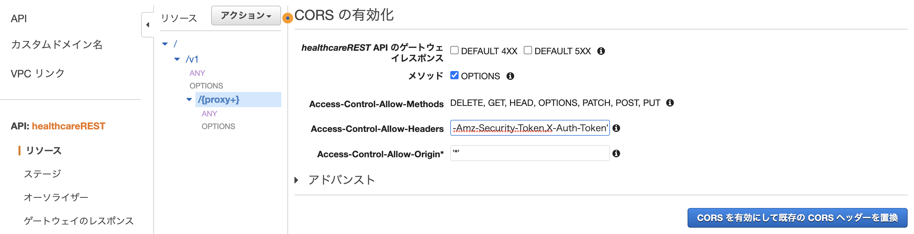
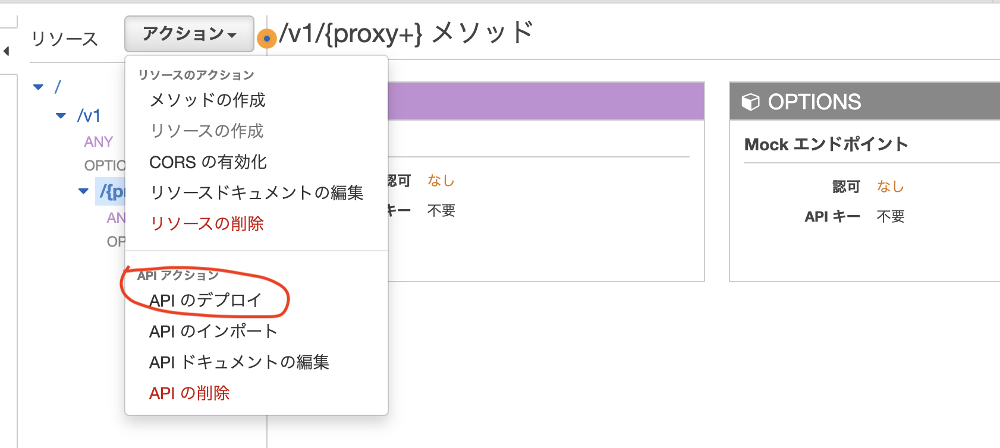
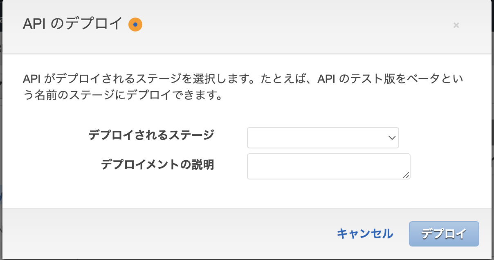

# REST API リソースで CORS サポートを有効にする
1. https://console.aws.amazon.com/apigateway で API Gateway コンソールにサインインします。
2. [API] リストから API を選択します。
3. [リソース] のリソースを選択します。これにより、リソースのすべてのメソッドで CORS が有効になります。または、リソースでメソッドを選択し、このメソッドのみで CORS を有効にできます。
4. [アクション] ドロップダウンメニューから [Enable CORS] を選択します。
5. [Enable CORS] フォームで、以下の操作を行います。
    - [Access-Control-Allow-Headers] 入力フィールドに、クライアントがリソースの実際のリクエストで送信する必要があるヘッダーのカンマ区切りリストの静的な文字列を入力します。コンソールで提供されたヘッダーのリスト 'Content-Type,X-Amz-Date,Authorization,X-Api-Key,X-Amz-Security-Token' を使用するか、独自のヘッダーを指定します。
        - API GatewayコンソールのCORSの有効化(X-Auth-Tokenを追加)
            ~~~
            'Content-Type,X-Amz-Date,Authorization,X-Api-Key,X-Amz-Security-Token,X-Auth-Token'
            ~~~
            
    - コンソールで提供された値 '*' を [Access-Control-Allow-Origin] ヘッダー値として使用してすべてのオリジンからのアクセスリクエストを許可するか、リソースへのアクセスを許可するオリジンを指定します。
    - [CORS を有効にして既存の CORS ヘッダーを置換] を選択します。
6. リソースで CORS サポートを有効にした後、新しい設定を有効にするには API をデプロイまたは再デプロイする必要があります。

    

# 参考
https://docs.aws.amazon.com/ja_jp/apigateway/latest/developerguide/how-to-cors-console.html